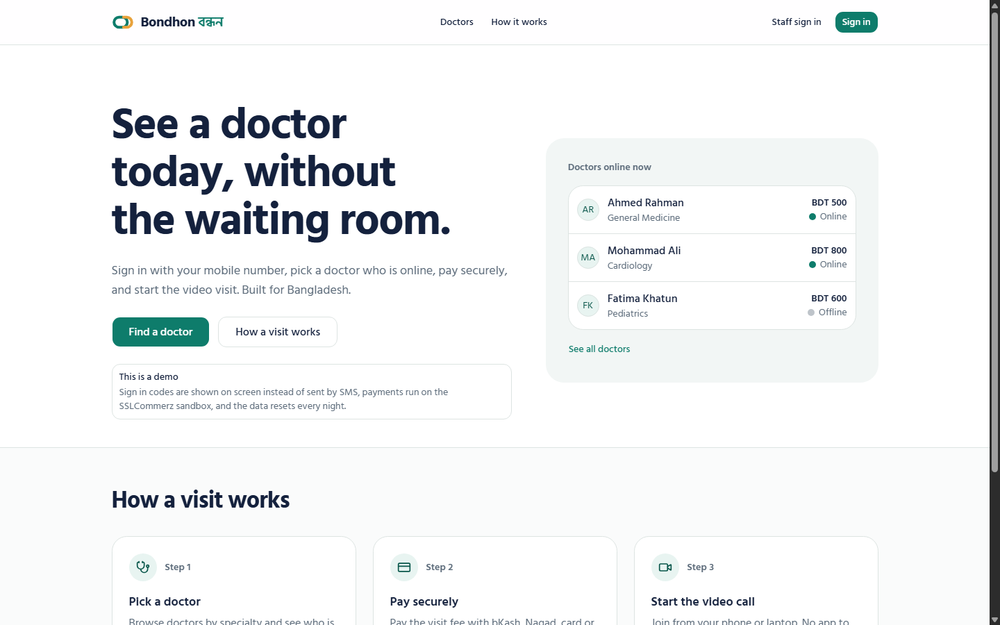
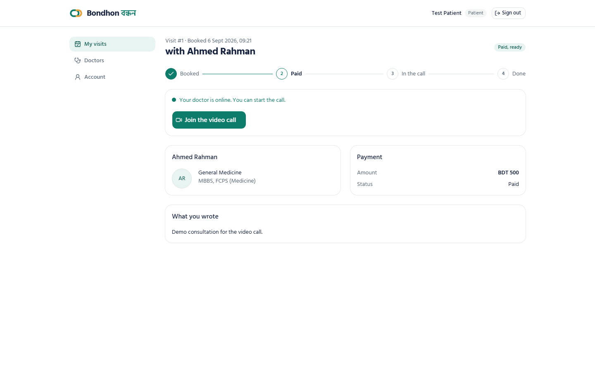
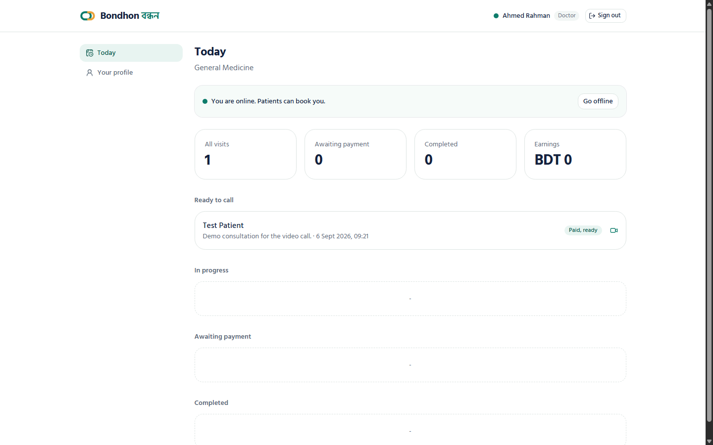

# Bondhon (বন্ধন)

A telemedicine platform for Bangladesh. A patient signs in with a mobile number, picks a
doctor who is online, pays the fee, and talks to the doctor on video in the browser. Doctors
run their day from a small desk. An admin sees the whole platform.

Live demo: **[bondhon.yakubhossain.dev](https://bondhon.yakubhossain.dev)**. Sign in codes
appear on screen in the demo, payments run against the SSLCommerz sandbox, and the data
resets every night.



| Visit page: pay, wait, call, done | Doctor's day |
| --- | --- |
|  |  |

## What it does

**Patients**

- Sign in with a mobile number and a six digit code. No password, no email.
- Browse doctors by specialty, see experience and fee, and see who is online now.
- Book a visit, pay through SSLCommerz (bKash, cards, banks), and join the video call
  from the same visit page. One page carries the whole journey: booked, paid, doctor
  ready, in the call, done.

**Doctors**

- Switch between online and offline with one control at the top of the day view.
- See who has paid and is ready to call, start the call, and keep a profile.

**Admin**

- Overview with counts and month by month numbers, doctor accounts (create, online
  toggle, password reset), patients, and every visit.

## Stack

| Layer | Choice |
| --- | --- |
| Web | Next.js 16 (App Router, TypeScript), React 19, Tailwind CSS 4, shadcn/ui, TanStack Query, react-hook-form with zod, next-intl, lucide icons |
| Type | Hind Siliguri, self hosted, one family for Bangla and Latin |
| API | Laravel 13, PHP 8.4, session cookies with the Sanctum CSRF cookie, Form Requests, Policies, named rate limiters |
| Video | Agora RTC, tokens built server side with Agora's own AccessToken2 builder |
| Payments | SSLCommerz, sandbox in the demo |
| Database | PostgreSQL in production, SQLite for local work and tests |
| Runtime | Two images: `serversideup/php` for the API, Node 22 standalone for the web |
| Hosting | GHCR images deployed by Coolify |

## How the pieces talk

The browser only ever talks to the web origin. Next.js forwards `/api/*` to the API
container over the platform network, so the session cookie is a plain same site cookie and
there is no cross origin surface in production. Locally the web app talks to the API on a
second port and the API allows that origin.

Video: the `ConsultationPolicy` checks that the signed in user belongs to the consultation
and that it is paid, then the API builds an Agora token for a numeric uid with a two hour limit. The React call
component follows the declarative model of `agora-rtc-react`: join, publish and subscribe
are driven by state, one client per call, and every failure shows as a plain sentence with
a retry.

## Security, in framework terms

Every protection is a Laravel or Next mechanism, not a hand written check.

- Sign in: named rate limiters (`otp-send`, `otp-verify`, `login`) per phone or email plus
  per IP, attached with the `throttle` middleware. Codes are stored hashed in the cache for
  five minutes and are single use. The session is regenerated on login and invalidated on
  logout.
- Authorization: a `role` middleware per route group and a `ConsultationPolicy` behind the
  `can` middleware, so a patient never reads another patient's visit and a doctor never
  reads another doctor's.
- Input: Form Requests for sign in and booking, validation rules on every other write.
- Payments: every SSLCommerz callback and IPN is confirmed through the validator API
  (status, transaction id, amount, currency), in the sandbox too. A callback never signs
  anyone in; the browser is sent back to the visit page and the patient's own session shows
  the result.
- Errors: API routes always answer in JSON and never return exception messages.
- Web: security headers from `next.config.ts`, same origin API, no `alert()` or
  `console.log`, `npm audit` clean.

Feature tests cover the rate limits, the authorization matrix, forged and replayed payment
callbacks, and the analytics query on SQLite.

## Run it locally

Requirements: PHP 8.4 and Composer, Node 22, or Docker.

API:

```bash
cd backend
cp .env.example .env
composer install
php artisan key:generate
touch database/database.sqlite
# .env: DB_CONNECTION=sqlite, DB_DATABASE=<absolute path>/database/database.sqlite
php artisan migrate --seed
php artisan serve --port=8001
```

Web:

```bash
cd frontend
npm install
printf "NEXT_PUBLIC_DEMO=true\nAPI_INTERNAL_URL=http://127.0.0.1:8001\n" > .env.local
npm run dev -- -p 3001
```

The web dev server forwards `/api` and `/sanctum` to the API, so the browser stays on one
origin. Leave `SESSION_DOMAIN` empty in the API `.env`. Open http://127.0.0.1:3001. The seed creates three doctors, a patient and one paid
consultation, so the video call page can be opened at once. Sign in codes are printed to the
response in local mode. Doctor and admin passwords are set by the seeder.

For a real call set `AGORA_APP_ID` and `AGORA_APP_CERTIFICATE` in the API `.env` from an
Agora project with a primary certificate.

## Tests

```bash
cd backend && php artisan test
```

## Deploy

Every push to `main` runs the API tests and the web build, builds both images for arm64 and
amd64, pushes them to `ghcr.io/1yakub/bondhon-api` and `ghcr.io/1yakub/bondhon-web`, and
asks Coolify to pull and restart each service. The API container carries the network alias
`bondhon-api`, which the web image's rewrite points at. Configuration is environment only;
the API reads every setting through `config()` so `config:cache` never empties a value.

## Repository layout

```
backend/   Laravel API: app/Classes/Agora (token builder), controllers, seeders, config/agora.php
frontend/  Next.js app: src/app (route groups per role), src/components (ui, site, video), src/lib (api, queries), messages/
.github/   CI: tests, images, deploy
```

## History

Built in 2025 as a rescue of an abandoned PHP codebase, rebuilt as Next plus Laravel. The
video call never connected in that version: the hand written Agora token was not a token
Agora could read, and the React component called a hook as a function. In September 2026
the token path was replaced with Agora's own builder, the call component rewritten, the
frameworks brought current, the interface redesigned on one design system for both scripts,
and the deployment moved to container images. A security audit then replaced every hand
written check with the framework's own mechanism and the web app was rebuilt in TypeScript
around one visit journey.

## License

MIT. See [LICENSE](LICENSE).
